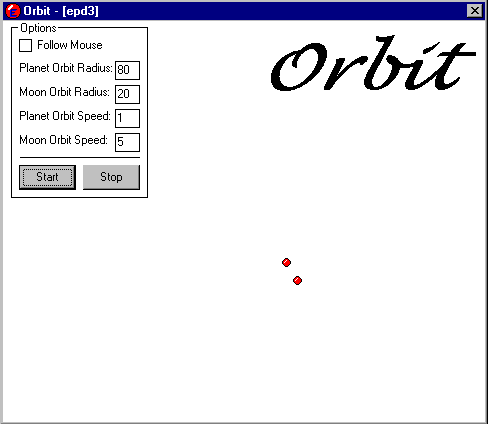



## Orbit \- Update

### Description

One ball orbits around another ball while the other ball can orbit around the mouse or the center of the form. In the update you can change almost all the variables that affect how the balls rotate.
 
### More Info
 

             |
---                |---
**Submitted On**   |2001-04-04 02:58:16
**By**             |[Edward P\. Denninger III](https://github.com/Planet-Source-Code/PSCIndex/blob/master/ByAuthor/edward-p-denninger-iii.md)
**Level**          |Advanced
**User Rating**    |3.3 (10 globes from 3 users)
**Compatibility**  |VB 5\.0, VB 6\.0
**Category**       |[Graphics](https://github.com/Planet-Source-Code/PSCIndex/blob/master/ByCategory/graphics__1-46.md)
**World**          |[Visual Basic](https://github.com/Planet-Source-Code/PSCIndex/blob/master/ByWorld/visual-basic.md)
**Archive File**   |[Orbit \- Up17897442001\.zip](https://github.com/Planet-Source-Code/edward-p-denninger-iii-orbit-update__1-22129/archive/master.zip)

